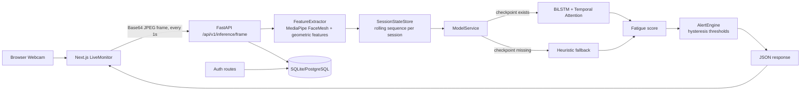

# Driver Drowsiness Detection System

End-to-end real-time driver fatigue monitoring project with:

- a FastAPI backend for frame inference and auth
- a Next.js dashboard for webcam streaming and live alerts
- an ML pipeline (MediaPipe feature extraction + BiLSTM with attention)

The system predicts one of three states:

- alert
- drowsy
- microsleep

and converts that prediction into a fatigue score and alert level:

- safe
- soft
- warning
- danger

## 1. What this repository contains

This repo is organized as a multi-part project:

- backend: API, inference pipeline, DB models, auth
- frontend: web UI and live monitor client
- ml: data preprocessing and model training scripts
- storage: deployed model artifact used by backend at runtime

## 2. High-level architecture



## 3. Repository structure and responsibilities

### 3.1 backend

- [backend/app/main.py](backend/app/main.py)
	- creates FastAPI app
	- applies CORS
	- creates DB tables on startup
	- registers auth + inference routers
- [backend/app/core/config.py](backend/app/core/config.py)
	- environment-driven settings (API prefix, DB URL, model path, JWT config)
- [backend/app/core/security.py](backend/app/core/security.py)
	- password hashing (bcrypt via passlib)
	- JWT creation and decode
- [backend/app/db/session.py](backend/app/db/session.py)
	- SQLAlchemy engine + session dependency
- [backend/app/models/user.py](backend/app/models/user.py)
	- users table
- [backend/app/models/driving_session.py](backend/app/models/driving_session.py)
	- driving_sessions table
- [backend/app/models/alert_event.py](backend/app/models/alert_event.py)
	- alert_events table
- [backend/app/routes/auth.py](backend/app/routes/auth.py)
	- register, login, and me endpoints
- [backend/app/routes/inference.py](backend/app/routes/inference.py)
	- frame decode, feature extraction, temporal inference
	- HTTP and WebSocket live inference endpoints
- [backend/app/services/feature_extractor.py](backend/app/services/feature_extractor.py)
	- computes frame-level features from MediaPipe landmarks
- [backend/app/services/model_service.py](backend/app/services/model_service.py)
	- loads BiLSTM checkpoint and predicts
	- uses heuristic mode if checkpoint is not found/loadable
- [backend/app/services/alert_engine.py](backend/app/services/alert_engine.py)
	- maps fatigue score to stable alert levels with hysteresis
- [backend/app/services/session_state.py](backend/app/services/session_state.py)
	- in-memory rolling buffers by session_id

### 3.2 frontend

- [frontend/src/app/page.tsx](frontend/src/app/page.tsx)
	- landing page
- [frontend/src/app/monitor/page.tsx](frontend/src/app/monitor/page.tsx)
	- monitoring dashboard page
- [frontend/src/components/LiveMonitor.tsx](frontend/src/components/LiveMonitor.tsx)
	- opens webcam
	- captures and sends one frame per second
	- receives inference response and updates UI
	- triggers progressive alarm sound based on score/level
- [frontend/src/lib/api.ts](frontend/src/lib/api.ts)
	- API wrapper for frame inference request
- [frontend/src/types/inference.ts](frontend/src/types/inference.ts)
	- response typings for inference pipeline

### 3.3 ml

- [ml/scripts/preprocess_videos.py](ml/scripts/preprocess_videos.py)
	- parses raw videos by class
	- extracts 10-D features per frame using MediaPipe
	- builds 30-frame sliding windows
	- saves processed arrays
- [ml/scripts/dataset.py](ml/scripts/dataset.py)
	- PyTorch Dataset wrapper over saved numpy arrays
- [ml/scripts/model.py](ml/scripts/model.py)
	- BiLSTM + TemporalAttention architecture
- [ml/scripts/train.py](ml/scripts/train.py)
	- train/val/test split
	- training loop + metrics + checkpoint save

### 3.4 storage

- [storage/models/drowsiness_bilstm.pt](storage/models/drowsiness_bilstm.pt)
	- runtime model artifact expected by backend settings

## 4. End-to-end runtime flow

1. User opens monitor page and clicks Start Camera.
2. Browser captures a video frame and encodes it as base64 JPEG.
3. Frontend posts to /api/v1/inference/frame.
4. Backend decodes base64 into BGR image with OpenCV.
5. Feature extractor computes 10 frame-level features.
6. Session store appends features for that session_id.
7. Before sequence length 30, backend returns status collecting.
8. At sequence length 30, backend predicts class probabilities.
9. Prediction is converted into fatigue score.
10. AlertEngine applies hysteresis and emits stable level + message.
11. Frontend displays score/level/prediction and plays alarm pattern.

## 5. Inference logic details

### 5.1 Frame feature vector (10 dimensions)

From [backend/app/services/feature_extractor.py](backend/app/services/feature_extractor.py):

1. ear_left
2. ear_right
3. ear_mean
4. mar (mouth aspect ratio)
5. head_pitch
6. head_yaw
7. head_roll
8. blink_flag
9. yawn_flag
10. gaze_dev (placeholder currently 0.0)

### 5.2 Sequence windowing

- Sequence length is fixed at 30 frames.
- Frontend sends 1 frame/second.
- First prediction appears after about 30 seconds.

### 5.3 Model and fallback behavior

From [backend/app/services/model_service.py](backend/app/services/model_service.py):

- If model checkpoint loads successfully:
	- inference source is model
	- BiLSTM + attention is used
- If checkpoint is absent or invalid:
	- inference source is heuristic
	- probabilities are estimated from EAR/MAR/head motion/blink/yawn features

This design allows API and UI to work even before full model training is complete.

### 5.4 Fatigue score computation

From [backend/app/routes/inference.py](backend/app/routes/inference.py):

Fatigue score is computed from class probabilities:

$$
score = 50 * P_{drowsy} + 100 * P_{microsleep}
$$

So score range is approximately 0 to 100.

### 5.5 Alert levels with hysteresis

From [backend/app/services/alert_engine.py](backend/app/services/alert_engine.py):

- nominal score zones:
	- safe: score < 30
	- soft: 30-49.99
	- warning: 50-74.99
	- danger: >= 75
- transitions are stateful and hysteretic to avoid rapid flicker
	- example: soft does not drop to safe until score < 25
	- warning does not drop to soft until score < 45
	- danger does not drop to warning until score < 70

## 6. API reference

Base prefix from settings: /api/v1

### 6.1 Health

- method: GET
- path: /health
- response:

```json
{ "status": "ok" }
```

### 6.2 Auth

From [backend/app/routes/auth.py](backend/app/routes/auth.py):

1. POST /api/v1/auth/register
	 - body:
	 ```json
	 {
		 "email": "driver@example.com",
		 "password": "strongpassword",
		 "full_name": "Driver Name"
	 }
	 ```

2. POST /api/v1/auth/login
	 - body:
	 ```json
	 {
		 "email": "driver@example.com",
		 "password": "strongpassword"
	 }
	 ```
	 - response:
	 ```json
	 {
		 "access_token": "<jwt>",
		 "token_type": "bearer"
	 }
	 ```

3. GET /api/v1/auth/me
	 - current implementation expects token as a query parameter named token
	 - example: /api/v1/auth/me?token=<jwt>

### 6.3 Frame inference (HTTP)

From [backend/app/routes/inference.py](backend/app/routes/inference.py):

- method: POST
- path: /api/v1/inference/frame
- body:

```json
{
	"session_id": "demo-session",
	"frame_base64": "data:image/jpeg;base64,..."
}
```

- possible statuses:
	- no_face_detected
	- collecting
	- ok
	- error

- example response when ready:

```json
{
	"status": "ok",
	"session_id": "demo-session",
	"sequence_length": 30,
	"score": 63.41,
	"level": "warning",
	"prediction": "drowsy",
	"message": "Warning: driver may be getting drowsy.",
	"source": "model"
}
```

### 6.4 Live inference (WebSocket)

- endpoint: /api/v1/inference/ws/live/{session_id}
- message format:

```json
{
	"frame_base64": "data:image/jpeg;base64,..."
}
```

Server responds with the same payload structure as HTTP inference.

## 7. Database model

Tables from SQLAlchemy models:

- users
	- identity, credentials, role, active status
- driving_sessions
	- belongs to user
	- stores optional aggregate score metadata
- alert_events
	- belongs to driving_session
	- stores per-event severity/prediction/score/message/frame index

Relationships:

- User 1..N DrivingSession
- DrivingSession 1..N AlertEvent

Note: tables are auto-created on backend startup via Base.metadata.create_all.

## 8. Configuration

Settings source is [backend/app/core/config.py](backend/app/core/config.py) using .env.

Key config values:

- app_name
- api_v1_prefix
- cors_origins
- database_url
- secret_key
- access_token_expire_minutes
- model_path

Default model_path is ../storage/models/drowsiness_bilstm.pt (relative to backend process working directory).

## 9. Local development setup (Windows/Linux/macOS)

## 9.1 Prerequisites

- Python 3.10+
- Node.js 20+
- npm
- Webcam access in browser

Optional:

- CUDA-compatible GPU for faster training/inference

## 9.2 Backend setup

From repository root:

```bash
cd backend
python -m venv .venv
```

Activate virtual environment:

- Windows PowerShell:

```powershell
.\.venv\Scripts\Activate.ps1
```

- Linux/macOS:

```bash
source .venv/bin/activate
```

Install dependencies:

```bash
pip install -r requirements.txt
```

Run backend API:

```bash
uvicorn app.main:app --reload --host 127.0.0.1 --port 8000
```

Backend URLs:

- API root health: http://127.0.0.1:8000/health
- Swagger docs: http://127.0.0.1:8000/docs

## 9.3 Frontend setup

Open a second terminal at repo root:

```bash
cd frontend
npm install
```

Configure API base URL if needed:

```bash
# frontend/.env.local
NEXT_PUBLIC_API_BASE_URL=http://127.0.0.1:8000/api/v1
```

Run frontend dev server:

```bash
npm run dev
```

Open:

- http://localhost:3000
- monitor page: http://localhost:3000/monitor

## 9.4 Quick smoke test

With backend running:

```bash
cd backend
python test_inference.py
```

This script posts a base64 image to the inference endpoint.

## 10. ML pipeline workflow

## 10.1 Raw data organization

Place videos under:

- ml/datasets/raw/alert
- ml/datasets/raw/drowsy
- ml/datasets/raw/microsleep

Accepted extensions include mp4, avi, mov, mkv.

## 10.2 Preprocess into temporal features

```bash
cd ml/scripts
python preprocess_videos.py
```

Outputs:

- ml/datasets/processed/X.npy
- ml/datasets/processed/y.npy
- ml/datasets/processed/meta.json

## 10.3 Train model

```bash
cd ml/scripts
python train.py
```

Training script details from [ml/scripts/train.py](ml/scripts/train.py):

- split: 70 percent train, 15 percent val, 15 percent test
- optimizer: AdamW
- loss: cross entropy
- epochs: 20
- checkpoint: saved when validation macro-F1 improves

Artifacts:

- ml/checkpoints/drowsiness_bilstm.pt
- ml/checkpoints/train_loss.png
- ml/checkpoints/val_loss.png

## 10.4 Promote model to backend runtime storage

Copy trained checkpoint to runtime location:

```bash
# from repo root
cp ml/checkpoints/drowsiness_bilstm.pt storage/models/drowsiness_bilstm.pt
```

On Windows PowerShell:

```powershell
Copy-Item ml/checkpoints/drowsiness_bilstm.pt storage/models/drowsiness_bilstm.pt -Force
```

Restart backend after replacing model file.

## 11. Frontend behavior and UX details

From [frontend/src/components/LiveMonitor.tsx](frontend/src/components/LiveMonitor.tsx):

- capture interval: 1000 ms
- payload format: JSON with session_id and frame_base64
- live status panel includes:
	- session id
	- backend status
	- sequence progress
	- fatigue score
	- predicted class
	- source (model or heuristic)
- alarm pattern scales by severity:
	- soft: lighter, less frequent beeps
	- warning: medium intensity/frequency
	- danger: strongest and most frequent pattern

## 12. Known behavior notes

- Inference needs 30 valid face-detected frames before predictions begin.
- If no face is detected in a frame, API returns no_face_detected and does not advance sequence.
- Backend stores sequence state in-memory; restarting backend clears all active session buffers.
- Auth me endpoint currently reads token from query parameter, not Authorization header.

## 13. Troubleshooting guide

## 13.1 Camera does not start in browser

- verify browser camera permission is allowed
- verify no other app is locking webcam
- check frontend console for permission errors

## 13.2 API returns invalid frame data

- ensure payload has frame_base64 key
- ensure base64 string is valid JPEG/PNG bytes
- data URL format is accepted (prefix is stripped if present)

## 13.3 Always seeing collecting status

- you need 30 valid feature frames
- no_face_detected frames do not fill the sequence buffer
- keep camera stable and face visible

## 13.4 Frontend cannot reach backend

- confirm backend is running on port 8000
- verify NEXT_PUBLIC_API_BASE_URL in frontend env
- verify CORS origin includes frontend host in backend settings

## 13.5 Model not being used

- check file exists at storage/models/drowsiness_bilstm.pt
- verify model_path in backend settings
- if load fails, backend will silently use heuristic source
- inspect response field source to confirm whether model or heuristic is active

## 14. Dependency overview

Backend major stack from [backend/requirements.txt](backend/requirements.txt):

- FastAPI + Uvicorn
- SQLAlchemy + Alembic + psycopg
- OpenCV + MediaPipe + NumPy/SciPy
- PyTorch ecosystem for ML model serving/training scripts
- auth/security libs: python-jose, passlib, bcrypt

Frontend stack from [frontend/package.json](frontend/package.json):

- Next.js 16 + React 19 + TypeScript
- Tailwind CSS v4
- shadcn ecosystem and utility libs
- lucide-react icons

## 15. Suggested production hardening

Current codebase is suitable for development and project demonstrations. For production, prioritize:

1. Move secret_key to secure environment/secret manager.
2. Use proper JWT auth dependency with Authorization header.
3. Persist session and alert events during inference, not only auth entities.
4. Add migrations workflow (Alembic) instead of create_all for schema evolution.
5. Add rate-limiting and request size constraints for frame endpoints.
6. Add structured logging and monitoring around inference latency and errors.
7. Add tests for feature extraction edge cases and alert hysteresis transitions.

## 16. Useful commands cheat sheet

Backend:

```bash
cd backend
uvicorn app.main:app --reload
```

Frontend:

```bash
cd frontend
npm run dev
```

Preprocess + train:

```bash
cd ml/scripts
python preprocess_videos.py
python train.py
```

## 17. File index for fast navigation

- [backend/app/main.py](backend/app/main.py)
- [backend/app/routes/auth.py](backend/app/routes/auth.py)
- [backend/app/routes/inference.py](backend/app/routes/inference.py)
- [backend/app/services/feature_extractor.py](backend/app/services/feature_extractor.py)
- [backend/app/services/model_service.py](backend/app/services/model_service.py)
- [backend/app/services/alert_engine.py](backend/app/services/alert_engine.py)
- [backend/app/services/session_state.py](backend/app/services/session_state.py)
- [frontend/src/components/LiveMonitor.tsx](frontend/src/components/LiveMonitor.tsx)
- [frontend/src/lib/api.ts](frontend/src/lib/api.ts)
- [ml/scripts/preprocess_videos.py](ml/scripts/preprocess_videos.py)
- [ml/scripts/train.py](ml/scripts/train.py)

---

If you want, the next step can be adding a dedicated API examples section with ready-to-run curl and PowerShell commands for every endpoint, plus a deployment section (Docker + cloud) in the same README.
