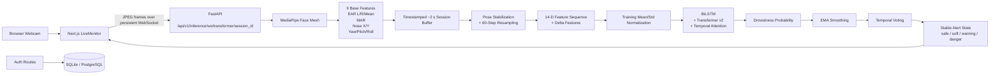

Driver Drowsiness Detection System
End-to-end real-time driver fatigue monitoring system using:
MediaPipe Face Mesh for facial landmark extraction
a 14-dimensional temporal feature representation
BiLSTM + Transformer Encoders + Temporal Attention
FastAPI for real-time inference and authentication
Next.js for webcam monitoring and live alerts
WebSocket streaming with backpressure for low-latency inference
EMA smoothing + temporal voting for stable alert decisions
PyTorch + CUDA for training and GPU inference
The upgraded system predicts a binary driver state:
`alert`
`drowsy`
The original dataset still contains three behavioral categories:
`alert`
`drowsy`
`microsleep`
For Transformer training, the labels are mapped as:
```text
alert      -> 0
drowsy     -> 1
microsleep -> 1
```
`microsleep` is therefore retained as a severe fatigue example rather than discarded.
The binary model output is converted into the user-facing alert levels:
`safe`
`soft`
`warning`
`danger`
through EMA smoothing, temporal voting and stateful transition logic.
---
1. Current project status
The project has moved beyond the original 10-feature BiLSTM pipeline.
Current upgraded pipeline:
```text
Webcam
  |
  v
Next.js LiveMonitor
  |
  | persistent WebSocket + backpressure
  v
FastAPI
  |
  v
MediaPipe Face Mesh
  |
  v
9 absolute geometric features
  |
  v
~2-second timestamped temporal history
  |
  v
Pose stabilization + 60-step resampling
  |
  v
5 temporal delta features
  |
  v
60 x 14 feature sequence
  |
  v
Training normalization
  |
  v
LayerNorm
  |
  v
Dense 14 -> 64
  |
  v
Learnable Positional Encoding
  |
  v
BiLSTM (32 units/direction)
  |
  v
Transformer Encoder #1
  |
  v
Transformer Encoder #2
  |
  v
Temporal Attention Pooling
  |
  v
Dense(64) + GELU + Dropout
  |
  v
Dense(1)
  |
  v
Sigmoid
  |
  v
Drowsiness Probability
  |
  v
EMA
  |
  v
Temporal Voting
  |
  v
Stable ALERT / DROWSY
  |
  v
safe / soft / warning / danger
  |
  v
Audio Alarm
```
Verified milestones
[x] 14-feature preprocessing
[x] 60-step temporal representation
[x] approximately 2-second time-normalized windows
[x] head-pose stabilization
[x] BiLSTM + Transformer architecture
[x] video-level train / validation / test split
[x] train-only normalization
[x] balanced training sampler
[x] GPU training
[x] validation threshold search
[x] deployment checkpoint
[x] FastAPI checkpoint loading
[x] live video -> feature -> Transformer smoke test
[x] EMA + temporal voting decision engine
[x] recovery behavior testing
[x] Transformer WebSocket route
[x] frontend WebSocket/backpressure design
[ ] final Stage-6 live FPS / latency benchmarking
[ ] larger subject-independent evaluation
---
2. Key improvements over the original implementation
Property	Original system	Current upgraded system
Frame features	10	14
Temporal representation	Fixed frame-count window	~2 s time-based window
Model input	45 x 10 / earlier variants	60 x 14
Temporal derivatives	No	Yes
Nose position	No	Yes
Sequence model	BiLSTM + temporal attention	BiLSTM + 2 Transformer encoders + temporal attention
Positional encoding	No	Learnable
Self-attention	No Transformer	4 heads x 2 encoders
Model output	3-class softmax	Binary drowsiness sigmoid
Runtime smoothing	Heuristic fatigue score / hysteresis	EMA + temporal voting + stable state logic
Streaming	Periodic HTTP frames	Persistent WebSocket + backpressure
Temporal FPS handling	Frame-count dependent	Timestamp-based resampling
Deployment model	`drowsiness_bilstm.pt`	`best_transformer_deploy.pt`
Measured test accuracy	Older report ~81%	95.35%
Test F1	Older report ~0.62 macro	0.9719 binary
> The old and new metrics are not perfectly apples-to-apples because the old model used three output classes while the new model performs binary alert-vs-fatigue classification.
---
3. Repository structure
A representative current structure is:
```text
driver-drowsiness-system/
|
|-- backend/
|   |-- app/
|   |   |-- core/
|   |   |   `-- config.py
|   |   |
|   |   |-- db/
|   |   |-- models/
|   |   |-- routes/
|   |   |   |-- auth.py
|   |   |   `-- inference.py
|   |   |
|   |   |-- schemas/
|   |   |   `-- inference.py
|   |   |
|   |   `-- services/
|   |       |-- feature_extractor.py
|   |       |-- model_service.py
|   |       |-- session_state.py
|   |       |-- alert_engine.py
|   |       |
|   |       |-- transformer_model_arch.py
|   |       |-- transformer_model_service.py
|   |       |-- transformer_feature_extractor.py
|   |       |-- transformer_session_state.py
|   |       `-- transformer_decision_state.py
|   |
|   |-- test_transformer_model.py
|   |-- test_transformer_runtime_pipeline.py
|   `-- test_transformer_decision.py
|
|-- frontend/
|   `-- src/
|       |-- app/
|       |-- components/
|       |   `-- LiveMonitor.tsx
|       |-- lib/
|       |   `-- api.ts
|       `-- types/
|           `-- inference.ts
|
|-- ml/
|   |-- datasets/
|   |   |-- raw/
|   |   |   |-- alert/
|   |   |   |-- drowsy/
|   |   |   `-- microsleep/
|   |   |
|   |   `-- processed/
|   |       |-- X_transformer.npy
|   |       |-- y_transformer.npy
|   |       `-- meta_transformer.json
|   |
|   |-- checkpoints/
|   |   |-- best_transformer.pt
|   |   |-- best_transformer_deploy.pt
|   |   |-- transformer_feature_mean.npy
|   |   |-- transformer_feature_std.npy
|   |   |-- transformer_split.json
|   |   |-- transformer_metrics.json
|   |   `-- transformer_detailed_evaluation.json
|   |
|   `-- scripts/
|       |-- feature_v2.py
|       |-- preprocess_transformer.py
|       |-- inspect_transformer_data.py
|       |-- transformer_model.py
|       |-- transformer_dataset.py
|       |-- train_transformer.py
|       `-- evaluate_transformer.py
|
`-- README.md
```
The original BiLSTM files may remain during migration, but the Transformer pipeline is the current architecture.
---
4. High-level architecture

```mermaid
flowchart LR

    CAM[Browser Webcam]
        --> UI[Next.js LiveMonitor]

    UI -->|JPEG frames over persistent WebSocket| API[
        FastAPI
        /api/v1/inference/ws/transformer/session_id
    ]

    API --> MP[
        MediaPipe Face Mesh
    ]

    MP --> BASE[
        9 Base Features
        EAR L/R/Mean
        MAR
        Nose X/Y
        Yaw/Pitch/Roll
    ]

    BASE --> TEMP[
        Timestamped ~2 s Session Buffer
    ]

    TEMP --> RES[
        Pose Stabilization
        + 60-Step Resampling
    ]

    RES --> F14[
        14-D Feature Sequence
        + Delta Features
    ]

    F14 --> NORM[
        Training Mean/Std Normalization
    ]

    NORM --> MODEL[
        BiLSTM
        + Transformer x2
        + Temporal Attention
    ]

    MODEL --> PROB[
        Drowsiness Probability
    ]

    PROB --> EMA[
        EMA Smoothing
    ]

    EMA --> VOTE[
        Temporal Voting
    ]

    VOTE --> ALERT[
        Stable Alert State
        safe / soft / warning / danger
    ]

    ALERT --> UI

    AUTH[Auth Routes]
        --> DB[(SQLite / PostgreSQL)]
```
---
5. Frame-level feature representation
The upgraded model uses 14 features per temporal step.
#	Feature	Meaning
1	`ear_left`	Left Eye Aspect Ratio
2	`ear_right`	Right Eye Aspect Ratio
3	`ear_mean`	Mean Eye Aspect Ratio
4	`mar`	Mouth Aspect Ratio
5	`nose_x`	Normalized nose X coordinate
6	`nose_y`	Normalized nose Y coordinate
7	`yaw`	Head yaw angle
8	`pitch`	Head pitch angle
9	`roll`	Head roll angle
10	`delta_ear`	Change in mean EAR
11	`delta_mar`	Change in MAR
12	`delta_yaw`	Change in yaw
13	`delta_pitch`	Change in pitch
14	`delta_roll`	Change in roll
Therefore each temporal vector is:
```text
f_t in R^14
```
and a complete model sample is:
```text
X in R^(60 x 14)
```
---
6. EAR and MAR
6.1 Eye Aspect Ratio
For six eye landmarks:
```text
EAR =
(||p2-p6|| + ||p3-p5||)
-----------------------
      2 ||p1-p4||
```
The system calculates:
left EAR
right EAR
mean EAR
Lower sustained EAR generally corresponds to greater eye closure.
6.2 Mouth Aspect Ratio
MAR represents mouth opening:
```text
MAR =
(vertical lip distances)
------------------------
     mouth width
```
The Transformer receives both the absolute MAR and its temporal change.
---
7. Head pose and angle stabilization
The backend estimates:
yaw
pitch
roll
using OpenCV `solvePnP`.
Euler angles can jump around the `-180 / +180` boundary.
Example:
```text
+179 deg -> -179 deg
```
Naive subtraction gives:
```text
-358 deg
```
although the physical movement is approximately:
```text
+2 deg
```
The current preprocessing/runtime pipeline therefore:
wraps angles consistently,
computes circular differences,
suppresses implausible source-frame pose jumps above approximately `45 deg`,
calculates temporal pose deltas from a continuous pose representation.
This prevents large artificial `delta_pitch` or `delta_roll` spikes.
---
8. Temporal window construction
The model is designed around approximately 2 seconds of driver behavior.
Instead of assuming every input is exactly 30 FPS, the system uses timestamp-aware resampling.
Examples:
```text
25 FPS source -> ~50 source observations over 2 s
30 FPS source -> ~60 source observations over 2 s
15 FPS source -> ~30 source observations over 2 s
```
All are transformed into:
```text
60 temporal steps
x
14 features
```
This keeps temporal duration approximately constant across different capture rates.
---
9. Dataset organization
Place videos under:
```text
ml/datasets/raw/
|
|-- alert/
|-- drowsy/
`-- microsleep/
```
Supported formats include:
`.mp4`
`.avi`
`.mov`
`.mkv`
`.webm`
Binary training label mapping:
```text
alert      -> 0
drowsy     -> 1
microsleep -> 1
```
---
10. Processed dataset
Current processed Transformer dataset:
```text
X shape: (6347, 60, 14)
y shape: (6347,)
dtype: float32
finite: True
```
Original-class sample distribution:
Class	Samples
Alert	983
Drowsy	1029
Microsleep	4335
Total	6347
Binary distribution:
```text
0 / alert    = 983
1 / fatigue  = 5364
```
---
11. Data splitting strategy
The project uses video-level splitting rather than random sequence-level splitting.
This is important because adjacent temporal windows overlap heavily.
Incorrect:
```text
video A window 1 -> train
video A window 2 -> validation
video A window 3 -> test
```
Correct:
```text
video A -> train only
video B -> validation only
video C -> test only
```
Actual split:
Split	Videos	Samples	Alert	Positive
Train	18	4554	720	3834
Validation	4	954	137	817
Test	4	839	126	713
Training original-class counts:
```text
alert       = 720
drowsy      = 760
microsleep  = 3074
```
---
12. Feature normalization
Normalization statistics are computed from the training split only:
```text
x_norm = (x - mean_train) / std_train
```
The same mean/std values are reused for:
validation
test
backend inference
They are stored inside the model checkpoint and separately as:
```text
ml/checkpoints/transformer_feature_mean.npy
ml/checkpoints/transformer_feature_std.npy
```
Do not recompute normalization statistics at runtime.
---
13. Class balancing
The training dataset is heavily biased toward microsleep windows.
The training sampler therefore targets approximately:
```text
alert       -> 50% sampling mass
drowsy      -> 25%
microsleep  -> 25%
```
This produces approximate binary balance while preventing microsleep windows from dominating ordinary drowsiness.
The loss therefore does not additionally use a positive-class weight.
---
14. Transformer model architecture
Model file:
```text
ml/scripts/transformer_model.py
```
Architecture:
```text
Input
(60, 14)

    |
    v

LayerNorm(14)

    |
    v

Linear
14 -> 64

    |
    v

Learnable Positional Encoding
(60 x 64)

    |
    v

BiLSTM
input = 64
hidden = 32
bidirectional = True
output = 64

    |
    v

Transformer Encoder #1
d_model = 64
heads = 4
FFN = 128
dropout = 0.10

    |
    v

Transformer Encoder #2
d_model = 64
heads = 4
FFN = 128
dropout = 0.10

    |
    v

Temporal Attention Pooling

    |
    v

Linear 64 -> 64

    |
    v

GELU

    |
    v

Dropout(0.30)

    |
    v

Linear 64 -> 1

    |
    v

Logit

    |
    v

Sigmoid during inference

    |
    v

Drowsiness Probability
```
Model size:
```text
Total parameters:     105310
Trainable parameters: 105310
```
---
15. Training configuration
Current training configuration:
Parameter	Value
Batch size	64
Maximum epochs	40
Initial learning rate	`3e-4`
Weight decay	`1e-4`
Optimizer	AdamW
Loss	BCEWithLogitsLoss
LR scheduler	ReduceLROnPlateau
Scheduler factor	0.5
Scheduler patience	2
Early stopping patience	7
Gradient clipping	1.0
Seed	42
Device	CUDA when available
Training GPU used	NVIDIA GeForce RTX 4050 Laptop GPU
The best validation checkpoint was obtained around epoch 7.
Best validation loss:
```text
0.09038
```
Training stopped at epoch 14 through early stopping.
---
16. Evaluation results
16.1 Refined validation threshold
Initial training searched:
```text
0.10 ... 0.90
```
and selected:
```text
0.10
```
A later detailed validation search over:
```text
0.01 ... 0.99
```
selected:
```text
0.01
```
as the best validation-F1 threshold.
Deployment checkpoint:
```text
ml/checkpoints/best_transformer_deploy.pt
```
contains:
```text
decision_threshold = 0.01
```
16.2 Validation metrics
At threshold `0.01`:
Metric	Value
Accuracy	99.06%
Precision	100.00%
Recall	98.90%
Specificity	100.00%
F1	0.9945
ROC-AUC	0.9999
PR-AUC	0.99998
Confusion matrix:
```text
TN = 137
FP =   0
FN =   9
TP = 808
```
16.3 Test metrics
Held-out test results:
Metric	Value
Accuracy	95.35%
Precision	99.85%
Recall / Sensitivity	94.67%
Specificity	99.21%
F1	0.9719
ROC-AUC	0.9979
PR-AUC	0.9996
Test confusion matrix:
```text
TN = 125
FP =   1
FN =  38
TP = 675
```
16.4 Original-class analysis
Original Class	Test Windows	Mean Probability	Predicted Drowsy Rate
Alert	126	0.000864	0.79%
Drowsy	86	0.998680	100.00%
Microsleep	627	0.855435	93.94%
The held-out drowsy video was detected correctly for all evaluated windows.
Most remaining false negatives came from the held-out microsleep video.
> The test split currently contains only four videos, so these results are promising but should not be interpreted as a complete real-world generalization study.
---
17. Training commands
From repository root:
```bash
python ml/scripts/preprocess_transformer.py
python ml/scripts/inspect_transformer_data.py
```
Compile model:
```bash
python -m py_compile ml/scripts/transformer_model.py
```
Model smoke test:
```bash
python ml/scripts/transformer_model.py
```
Train:
```bash
python ml/scripts/train_transformer.py
```
Detailed evaluation:
```bash
python ml/scripts/evaluate_transformer.py
```
---
18. Generated ML artifacts
Processed dataset:
```text
ml/datasets/processed/
|-- X_transformer.npy
|-- y_transformer.npy
`-- meta_transformer.json
```
Checkpoint artifacts:
```text
ml/checkpoints/
|-- best_transformer.pt
|-- best_transformer_deploy.pt
|-- transformer_feature_mean.npy
|-- transformer_feature_std.npy
|-- transformer_split.json
|-- transformer_metrics.json
`-- transformer_detailed_evaluation.json
```
`best_transformer.pt`
Original best training checkpoint.
`best_transformer_deploy.pt`
Deployment copy with the refined decision threshold:
```text
0.01
```
The original training checkpoint is intentionally preserved unchanged.
---
19. Backend Transformer services
`transformer_model_arch.py`
Deployment copy of the PyTorch architecture.
It must match the training architecture exactly so `state_dict` loading is valid.
`transformer_model_service.py`
Responsibilities:
resolve checkpoint path
load checkpoint
load architecture config
load trained normalization statistics
normalize `(60, 14)` sequences
run GPU/CPU inference
convert logit through sigmoid
apply decision threshold
The service intentionally does not silently fall back to heuristic inference.
If loading fails, the Transformer error is surfaced explicitly.
`transformer_feature_extractor.py`
Extracts the nine runtime base features:
```text
EAR left
EAR right
EAR mean
MAR
nose X
nose Y
yaw
pitch
roll
```
`transformer_session_state.py`
Responsibilities:
timestamp incoming observations
keep approximately two seconds of source history
stabilize head pose
resample to 60 temporal steps
compute five delta features
return a finite `(60, 14)` sequence
Current important constants:
```text
SEQ_LEN = 60
WINDOW_SECONDS = 2.0
MIN_SOURCE_SAMPLES = 12
MAX_POSE_STEP_DEGREES = 45.0
```
`transformer_decision_state.py`
Responsibilities:
EMA probability smoothing
recent prediction voting
stable alert/drowsy state
recovery logic
UI alert severity
---
20. EMA + temporal voting
The model's raw probability is not used to trigger the alarm directly.
20.1 EMA
Conceptually:
```text
EMA_t =
alpha * probability_t
+
(1-alpha) * EMA_(t-1)
```
Current asymmetric behavior:
```text
rise alpha = 0.50
fall alpha = 0.70
```
The larger fall alpha helps the detector recover faster when the driver becomes alert again.
20.2 Voting
Recent predictions are stored in a five-element vote window.
Example:
```text
0 0 1 1 1
```
gives:
```text
vote ratio = 3 / 5 = 0.60
```
Current decision settings:
```text
vote window       = 5
minimum votes     = 3
enter ratio       = 0.60
exit ratio        = 0.20
```
The ML model remains binary:
```text
alert
drowsy
```
The operational severity is separately mapped to:
```text
safe
soft
warning
danger
```
---
21. Decision-engine verified behavior
Decision smoke testing produced the intended behavior.
Stable alert
Low probabilities remain:
```text
prediction = alert
level = safe
```
Drowsiness onset
After sustained high probabilities:
```text
safe
-> soft
-> warning
-> danger
```
Recovery
After the probability falls:
```text
danger
-> warning
-> safe
```
The recovery path was intentionally designed to avoid the old behavior where the alarm could continue long after the driver woke up.
---
22. Backend API reference
Base prefix:
```text
/api/v1
```
22.1 Health
```http
GET /health
```
Example:
```json
{
  "status": "ok"
}
```
22.2 Auth
Existing auth endpoints remain:
```text
POST /api/v1/auth/register
POST /api/v1/auth/login
GET  /api/v1/auth/me
```
22.3 Legacy HTTP inference
During migration the original route may remain available:
```text
POST /api/v1/inference/frame
```
This is the old BiLSTM/hybrid path and is not the preferred Transformer streaming path.
22.4 Transformer HTTP inference
Parallel Transformer endpoint:
```text
POST /api/v1/inference/transformer/frame
```
Request:
```json
{
  "session_id": "demo-session",
  "frame_base64": "data:image/jpeg;base64,..."
}
```
Possible statuses:
```text
no_face_detected
collecting
ok
error
```
22.5 Transformer WebSocket
Current real-time Transformer route:
```text
/api/v1/inference/ws/transformer/{session_id}
```
Example local URL:
```text
ws://127.0.0.1:8000/api/v1/inference/ws/transformer/demo-session
```
Client message:
```json
{
  "frame_base64": "data:image/jpeg;base64,..."
}
```
Example collecting response:
```json
{
  "status": "collecting",
  "session_id": "demo-session",
  "sequence_length": 42,
  "sequence_ready": false,
  "source_samples": 19,
  "coverage_seconds": 1.31,
  "message": "Collecting approximately 2 seconds of temporal face features.",
  "source": "transformer"
}
```
Example ready response:
```json
{
  "status": "ok",
  "session_id": "demo-session",
  "sequence_length": 60,
  "sequence_ready": true,
  "source_samples": 28,
  "coverage_seconds": 2.01,
  "score": 93.1,
  "level": "danger",
  "prediction": "drowsy",
  "message": "Critical drowsiness alert. Wake up and stop safely.",
  "source": "transformer",
  "raw_probability": 0.9982,
  "smoothed_probability": 0.931,
  "decision_threshold": 0.01,
  "vote_ratio": 0.8
}
```
---
23. Frontend real-time behavior
`LiveMonitor.tsx` uses the Transformer WebSocket instead of low-rate HTTP polling.
Main responsibilities:
open webcam
show live feed
downscale inference frames
JPEG-compress frames
open Transformer WebSocket
apply backpressure
update inference status
display temporal progress
display raw probability
display EMA probability
display vote ratio
display prediction
play progressive alarm patterns
optionally record webcam video
Recommended/current inference-frame configuration:
```text
inference width = 640 px
target send interval ~= 75 ms
```
This gives an upper target near:
```text
13.3 FPS
```
but actual processed FPS is naturally limited by backend response time.
---
24. Why WebSocket backpressure matters
The frontend sends a new frame only when the previous frame has been processed.
Conceptually:
```text
send frame
|
wait for inference
|
receive response
|
send next frame
```
rather than:
```text
send
send
send
send
send
...
```
This prevents inference queues from accumulating stale frames.
That is especially important when the driver transitions from:
```text
drowsy -> alert
```
because an old frame queue could otherwise keep the alarm active even after the driver's current state has changed.
---
25. Runtime smoke tests
25.1 Checkpoint loading
From `backend/`:
```bash
python test_transformer_model.py
```
Verified output includes:
```text
Loaded: True
Sequence length: 60
Input dimension: 14
Threshold: 0.01
```
Example verified predictions:
```text
alert sample:
probability ~= 0.00048
prediction = alert

drowsy sample:
probability ~= 0.99873
prediction = drowsy
```
25.2 Full runtime video pipeline
```bash
python test_transformer_runtime_pipeline.py
```
Verified alert video example:
```text
Sequence shape: (60, 14)
Finite: True
Prediction: alert
Probability ~= 0.00048
```
Verified drowsy video example:
```text
Sequence shape: (60, 14)
Finite: True
Prediction: drowsy
Probability ~= 0.99874
```
25.3 Decision logic
```bash
python test_transformer_decision.py
```
This validates:
stable alert state
gradual drowsiness entry
danger escalation
recovery back to safe
---
26. Configuration
Backend settings are read from:
```text
backend/app/core/config.py
```
Important model paths:
```text
legacy model path:
../storage/models/drowsiness_bilstm.pt

Transformer deployment path:
../ml/checkpoints/best_transformer_deploy.pt
```
Typical frontend environment:
```env
NEXT_PUBLIC_API_BASE_URL=http://127.0.0.1:8000/api/v1
```
---
27. Local development setup
27.1 Prerequisites
Recommended:
Python 3.11
Node.js 20+
npm
webcam access
Windows / Linux / macOS
optional CUDA-compatible GPU
The current Transformer was trained and tested on:
```text
NVIDIA GeForce RTX 4050 Laptop GPU
```
---
28. Backend setup
From repository root:
```bash
cd backend
python -m venv .venv
```
Windows PowerShell:
```powershell
.\.venv\Scripts\Activate.ps1
```
Linux/macOS:
```bash
source .venv/bin/activate
```
Install dependencies:
```bash
pip install -r requirements.txt
```
Run:
```bash
uvicorn app.main:app --reload --host 127.0.0.1 --port 8000
```
Useful endpoints:
```text
http://127.0.0.1:8000/health
http://127.0.0.1:8000/docs
```
---
29. Frontend setup
From repository root:
```bash
cd frontend
npm install
```
Create/update:
```text
frontend/.env.local
```
with:
```env
NEXT_PUBLIC_API_BASE_URL=http://127.0.0.1:8000/api/v1
```
Build:
```bash
npm run build
```
Run development server:
```bash
npm run dev
```
Open:
```text
http://localhost:3000
```
Monitor page:
```text
http://localhost:3000/monitor
```
---
30. End-to-end startup
Terminal 1:
```powershell
cd backend
.\.venv\Scripts\Activate.ps1
uvicorn app.main:app --reload
```
Terminal 2:
```powershell
cd frontend
npm run dev
```
Then open:
```text
http://localhost:3000/monitor
```
Click:
```text
Start Camera
```
Initial state:
```text
status = collecting
sequence < 60
coverage < ~2 seconds
```
When enough history exists:
```text
status = ok
sequence = 60 / 60
source = transformer
```
---
31. Frontend diagnostic fields
The monitoring interface should expose:
```text
Session
Backend status
Sequence progress
Temporal coverage
Source frame count
Raw probability
EMA probability
Vote ratio
Score
Prediction
Alert level
Inference source
```
These values are useful for tuning and debugging.
---
32. Database model
Existing SQLAlchemy models include:
`users`
`driving_sessions`
`alert_events`
Relationships:
```text
User 1..N DrivingSession

DrivingSession 1..N AlertEvent
```
The current ML upgrade primarily changes the inference stack; authentication and persistence modules remain structurally separate.
---
33. Legacy path
During development/migration the repository may still contain:
```text
feature_extractor.py
model_service.py
session_state.py
alert_engine.py
preprocess_videos.py
model.py
train.py
```
These belong to the earlier BiLSTM pipeline.
New Transformer production files use the `transformer_*` names to avoid breaking the previous implementation during migration.
Once the Transformer frontend and Stage-6 live testing are complete, the legacy path can be retired or moved under a `legacy/` directory.
---
34. Troubleshooting
34.1 Transformer model is not loading
Run:
```bash
cd backend
python test_transformer_model.py
```
Check:
```text
Loaded: True
Load error: None
```
Verify:
```text
ml/checkpoints/best_transformer_deploy.pt
```
exists.
---
34.2 Always seeing `collecting`
Check:
webcam face is visible
temporal coverage is increasing
source frame count is increasing
WebSocket is connected
the frontend is not using the old low-rate HTTP route
Runtime sequence readiness requires approximately:
```text
1.85 - 2.0 seconds
```
of temporal context.
---
34.3 `no_face_detected`
Possible causes:
face outside frame
poor lighting
camera angle too extreme
strong occlusion
sunglasses / landmark failure
The Transformer temporal context is reset when the face disappears.
---
34.4 Alarm remains active too long
Inspect:
```text
raw_probability
smoothed_probability
vote_ratio
level
```
The current decision engine uses faster EMA decay when probability falls.
Also confirm WebSocket backpressure is active so old frames are not queued.
---
34.5 Invalid checkpoint state dict
The backend architecture must match:
```text
ml/scripts/transformer_model.py
```
exactly.
Do not rename internal PyTorch module fields unless the checkpoint is retrained or migrated.
---
34.6 CUDA is unavailable
Check:
```bash
python -c "import torch; print(torch.cuda.is_available())"
```
If false, inference will use CPU.
---
34.7 Frontend cannot connect to Transformer WebSocket
Check backend:
```text
http://127.0.0.1:8000/health
```
Check environment:
```env
NEXT_PUBLIC_API_BASE_URL=http://127.0.0.1:8000/api/v1
```
Expected WebSocket URL:
```text
ws://127.0.0.1:8000/api/v1/inference/ws/transformer/demo-session
```
---
35. Stage-6 real-time validation
Offline Transformer evaluation is complete.
The final deployment-validation stage should measure:
Metric	Status
Effective processed FPS	Pending final measurement
Mean frame round-trip latency	Pending final measurement
P95 inference latency	Pending final measurement
Drowsiness alert onset delay	Pending final measurement
Wake-up recovery delay	Pending final measurement
Long-run WebSocket stability	Pending final measurement
Do not publish guessed values.
Recommended Stage-6 tests:
30-60 seconds normal alert behavior.
Sustained eye closure.
Repeated slow blinking.
Head-drop simulation.
Yawn-like mouth behavior.
Recovery after danger state.
Temporary face disappearance.
Low-light behavior.
High CPU/GPU load.
5-10 minute continuous WebSocket run.
---
36. Known limitations
Current limitations include:
The test set contains only four held-out videos.
Binary training combines drowsy and microsleep into one positive class.
Raw sigmoid scores are not perfectly probability-calibrated.
Current best validation threshold is unusually low (`0.01`).
Landmark performance can degrade under strong occlusion or poor lighting.
Subject-level train/test separation should be used when reliable subject IDs are available.
Webcam-based fatigue estimation is not a medical diagnostic system.
Final Stage-6 FPS and latency benchmarks still need to be measured on the completed frontend.
---
37. Production hardening
Before production deployment, consider:
Move JWT/secret keys to a secure secret manager.
Use Authorization header-based authentication.
Persist driving sessions and alert events during inference.
Add Alembic migrations instead of relying only on `create_all`.
Add WebSocket authentication.
Add maximum JPEG/request-size checks.
Add connection-rate and inference-rate limiting.
Add structured logs for:
inference latency
MediaPipe failures
model errors
WebSocket reconnects
Add session cleanup / expiry.
Add Prometheus/OpenTelemetry metrics.
Add calibrated decision-threshold evaluation on a larger dataset.
Evaluate subject-independent generalization.
Consider ONNX/TensorRT for lower latency.
---
38. Useful commands cheat sheet
Backend
```bash
cd backend
uvicorn app.main:app --reload
```
Frontend
```bash
cd frontend
npm run dev
```
Transformer preprocessing
```bash
python ml/scripts/preprocess_transformer.py
python ml/scripts/inspect_transformer_data.py
```
Model test
```bash
python ml/scripts/transformer_model.py
```
Train
```bash
python ml/scripts/train_transformer.py
```
Detailed evaluation
```bash
python ml/scripts/evaluate_transformer.py
```
Backend checkpoint test
```bash
cd backend
python test_transformer_model.py
```
Runtime video pipeline test
```bash
cd backend
python test_transformer_runtime_pipeline.py
```
Decision logic test
```bash
cd backend
python test_transformer_decision.py
```
---
39. Fast file index
Backend
`backend/app/main.py`
`backend/app/core/config.py`
`backend/app/routes/inference.py`
`backend/app/schemas/inference.py`
`backend/app/services/transformer_model_arch.py`
`backend/app/services/transformer_model_service.py`
`backend/app/services/transformer_feature_extractor.py`
`backend/app/services/transformer_session_state.py`
`backend/app/services/transformer_decision_state.py`
Frontend
`frontend/src/components/LiveMonitor.tsx`
`frontend/src/lib/api.ts`
`frontend/src/types/inference.ts`
Machine Learning
`ml/scripts/feature_v2.py`
`ml/scripts/preprocess_transformer.py`
`ml/scripts/inspect_transformer_data.py`
`ml/scripts/transformer_model.py`
`ml/scripts/transformer_dataset.py`
`ml/scripts/train_transformer.py`
`ml/scripts/evaluate_transformer.py`
Checkpoints
`ml/checkpoints/best_transformer.pt`
`ml/checkpoints/best_transformer_deploy.pt`
`ml/checkpoints/transformer_feature_mean.npy`
`ml/checkpoints/transformer_feature_std.npy`
`ml/checkpoints/transformer_metrics.json`
`ml/checkpoints/transformer_detailed_evaluation.json`
---
40. Current model summary
```text
Task:
Binary driver fatigue detection

Input:
~2 seconds of facial behavior

Input tensor:
60 x 14

Architecture:
LayerNorm
-> Linear(14,64)
-> Learnable Position Encoding
-> BiLSTM(32 bidirectional)
-> Transformer Encoder x2
-> Temporal Attention Pooling
-> Linear(64,64)
-> GELU
-> Dropout(0.30)
-> Linear(64,1)

Parameters:
105,310

Optimizer:
AdamW

Loss:
BCEWithLogitsLoss

Deployment threshold:
0.01

Test:
Accuracy     95.35%
Precision    99.85%
Recall       94.67%
Specificity  99.21%
F1           0.9719
ROC-AUC      0.9979
PR-AUC       0.9996

Runtime decision:
Sigmoid probability
-> EMA
-> temporal voting
-> stable alert/drowsy state

Deployment:
Next.js
-> WebSocket
-> FastAPI
-> MediaPipe
-> PyTorch Transformer
-> live alert UI
```
---
41. Future work
Potential next improvements:
explicit subject-level splitting
larger and more diverse test set
probability calibration / temperature scaling
separate drowsy-vs-microsleep severity head
infrared / night-driving support
personalized EAR/MAR baselines
ONNX / TensorRT export
edge-device deployment
multimodal fusion with vehicle telemetry
improved head-pose estimation
model quantization
continuous real-world driver evaluation
---
42. Important note on reported metrics
The current offline metrics are based on the current video-level split and should be reported with the evaluation protocol.
They should not be presented as universal real-world performance.
Final real-time FPS, latency, alert-onset time and recovery time must be measured during Stage 6 before being added to project documentation or reports.